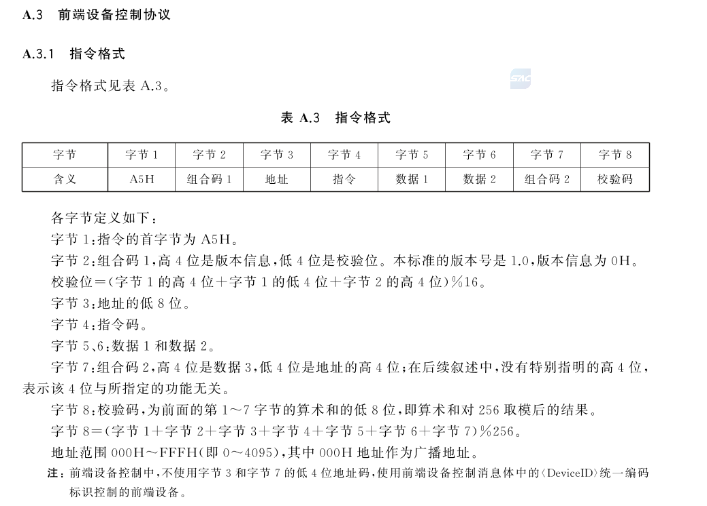
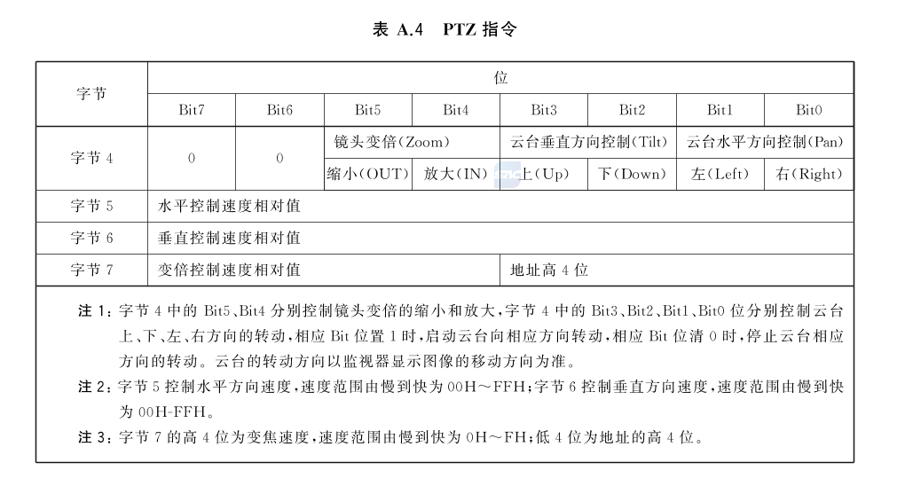

## GB28181-2016 标准对于设备控制的协议规定


### 前端设备控制协议

下面是国标28181-2016 标准对于前端设备控制协议的规定，摘抄自国标文档附录 A.3.1：



#### 解析

下面对每一个字节做详细解释。


**字节1**

指令的首字节为A5H，H代表的是该数是一个十六进制数，所以A5是一个十六进制数。


**字节2**

字节码2由2部分组成，一个字节有8个bit，高4位bit代表的是版本信息；低4位bit代表的是校验位

文档已经给出版本信息是**0H**，所以该字节的高4位bit都是0。

那低四位是校验位，那校验位该如何算呢？

已知字节1是A5H，所以它的bit会是：10100101；将这8个bit分割就得出2个数：1010和0101了，字节2的高4位是0000。

所以将3个数加起来再对16取模，得出以下计算过程：

（1010 + 0101 + 0000）% 16

（10 + 5 + 0） % 16

15 % 16 = 15

所以字节2的校验位会是15，使用十六进制表达也就是 **0xF**。然后将字节2的高4位 0 和低四位 F 结合一起就得出字节2的最终值：**0F**。


**字节3**

该字节代表一个地址，这里固定写01。


**字节4**

该字节是一个**指令码**，该指令码会具体的分有PTZ云台控制指令、FI光圈控制指令、预置位指令、巡航指令、扫描指令、辅助开关指令。

下面会有专门的去介绍这些指令。


**字节5和字节6**

这两个字节都是与字节4相关，是字节4的辅助数据位，要结合字节4指令码才能得出具体的动作参数。


**字节7**

字节7是一个组合码，与字节2相同，高4位是数据3的高4位，低4位一般没有起作用，这里会置0。


**字节8**

字节8是一个校验位，校验的规则是对前7个字节的和然后对256取模：

```
（字节1+字节2+字节3+字节4+字节5+字节6+字节7）% 256
```


### PTZ指令


#### 标准规定




#### 示例

PTZ示例指令：

```
A50F0101FFFFF0A4
```

以上指令会控制摄像头云台以水平255、垂直255的速度向右转动。


#### 解析

**字节4**

指令码以一个字节来表示，高位的前两个bit不做表示，也就是：

```
一个字节有8个bit：
0000 0000

现在前2个不做表示：
00 000000
```


有作用的也就是后6个bit，从高到低，这些bit分别控制云台的镜头缩小、镜头放大、上、下、左、右；如果有做对应的操作，就将对应的bit位置1。

所以示例中的指令：`A50F0101FFFFF0A4`，抛开前三个字节`A50F01`，`01`这里也就代表着PTZ指令码。它转成二进制就是：

```
0000 0001
```


根据PTZ指令的规定，在bit0的位置置1代表这右转，所以该PTZ指令就以字节5和字节6的速度去向右转动。

那其他方向的转动和取值呢？下面我贴出源代码（internal/gb/command.go 225行）给大家参考一下：

```go
switch command {
    case "right":
    // 0000 0001
    cmd = 1
    case "left":
    // 0000 0010
    cmd = 2
    case "down":
    // 0000 0100
    cmd = 4
    case "up":
    // 0000 1000
    cmd = 8
    case "downright":
    // 0000 0101
    cmd = 5
    case "downleft":
    // 0000 0110
    cmd = 6
    case "upright":
    // 0000 1001
    cmd = 9
    case "upleft":
    // 0000 1010
    cmd = 10
    case "zoomin":
    // 0001 0000
    cmd = 16
    case "zoomout":
    // 0010 0000
    cmd = 32
    case "stop":
    cmd = 0
    default:
    return "", errors.New("不合规的控制字符串")
}
```

在设置cmd的值后，使用 `fmt` 包的格式化占位符将值转成十六进制数。

为什么在停止转动的时候 cmd 的值为0呢？因为为0的话二进制数全部bit位都会置0，就不会有其他方向的转动也就停止了。


**字节5和字节6**

字节5和字节6在PTZ指令中代表着水平速度和垂直速度，0H最快，FFH最快。

文档中给的数值都是十六进制数，转换一下就是0～255。因为速度表示都是一个字节，一个字节所能表示的最大数字就是255。


**字节7**

字节7在PTZ指令中代表的是变倍速度，也就是变焦速度。但这一字节采用的是组合码的方式，也就是高4位是变焦速度，速度范围是 0H ～ FH；低四位是地址的高4位。

在项目里传入的值依然是0～255，这样方便与水平速度和垂直速度统一控制。另外，如果传入的变倍速度为0的话也不要紧，这样只是变倍的速度是最慢变倍而已，并不是不变倍了。

字节7的低4位是地址的高4位，在前面的前端设备控制协议章节里，地址一般固定是01，所以地址的高4位也就是00，也就是字节7的低四位永远是00。

所以在传入变倍速度后，项目中会做一个与操作，和 `0XF0`做一个与的操作，该操作会保留高4位bit，而将低4位bit置0

```go
// 最后字节7的高4位用于表示变倍控制速度，后4位不关注
// 所以这里直接与0xF0做与操作，保留前4位，后4为置0
c := combineCode & 0xF0
ptz.WriteString(fmt.Sprintf("%02X", c))
```


**字节8**

字节8是校验位，代码如下：

```go
// 字节8用于校验位，根据gb标准，校验位=(字节1+字节2+字节3+字节4+字节5+字节6+字节7) % 256
checkCode := (0xA5 + 0x0F + 0x01 + cmd + params1 + params2 + c) % 0x100
```

